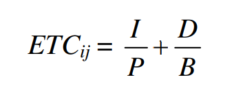

# Multi-cloud distributed task scheduling for cost and QoS optimization


Cloud computing offers the ability to provision resources as required on a per-task basis. Due to the growth of Cloud computing, there are many challenges faced today. One of these challenges is scheduling tasks to minimize cost in respect to runtime. Task scheduling is considered an NP hard problem with O(m*n) complexity when running n tasks on m resources.

In a multi-cloud scenario we still want to select the best resource to run a task on. However due to cost models that scale independently and the fact that measured performance that can vary from reported performance, this problem isn't as simple as it sounds. Optimally we want our algorithm to select the resource that would run at the highest performance to cost ratio. 

## Proposed Algorithm

The algorithm I am proposing is a modified scheduling algorithm that has been adapted to factor in the cost of a VM and it’s actual performance versus the performance as reported by the cloud provider. The first step is to initialize a queue of all the tasks we want to run. We then start by building a cost to performance ratio for each machine that we want to run the current task on. After some variable initialization, we identify the highest performance to cost ratio. This will not specifically select the fastest or the cheapest machine, but the  machine that will run the fastest for the lowest cost. We then identify the cloud provider that our selected VM is running on and attempt to schedule our task to that Virtual Machine. In the case that the scheduling fails, we attempt to reschedule.

```
let Q = A queue of all tasks to run
let n = the # of VMs across all clouds
let ETC(i,j) = The expected runtime of Task i on VM j
let CPMS(j) = The cost per ms of runtime on VM j
let M = Total # of clouds
While Q != null
    i <- dequeue(Q)
    for j = 1,2,3, ... , n
        RtC(i,j) = ETC(i,j)/CPMS(j)
    endfor
    maximum = RtC(i,1)
    index = 1
    for j = 2,3,4, ... , n
        if maximum < RtC(i,j)
            maximum = RtC(i,j)
            index = j
        endif
    endfor
    for k = 1,2,3, ... , M
        if index virtual machine is delpoyed under a cloud k
            SCHEDULE(i,k,index)
            while the task is not schedulable
                RESCHEDULE(i,k,index)
            endwhile
        endif
    endfor
endwhile
```
### ETC Formula



## Experimental Parameters

A large selection of algorithms to schedule tasks currently exist. I will be comparing my proposed algorithm to these algorithms to test its performance.

I will experiment with this algorithm first on CloudSim to get a working model and then scale it to run on the three main cloud providers, amazon, google, and microsoft.

CloudSim set up to simulate cloud federation using three instances with 200 cloudlets each.
Practical testing will use machines on their respective clouds. 

Cloud 1 : (2X) Google Cloud n1-standard-1 (1 vCPU, 3.75GB RAM)\
Cloud 2 : (2X) AWS a1.medium (1 vCPU, 2GB RAM)\
Cloud 3 : (2X) Azure DS1 v2 (2 vCPU, 3.5GB RAM)